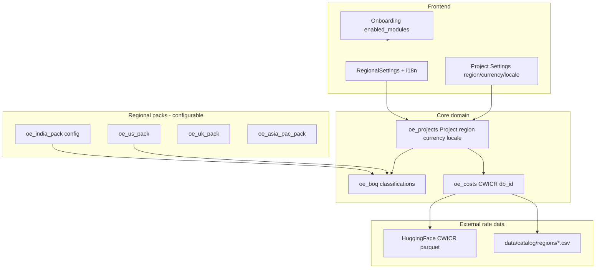

# CivilCore (IBSConstructionERP) — Phase 1 Cleanup Audit

**Repository:** `/Users/SPXMAC030/Project/civil/IBSConstructionERP`  
**Audit date:** 2026-09-13  
**Scope:** Phase 1 Steps 1–2 — inventory and decisions only. **No deletions or application code changes** (this document only).  
**Counts verified:** **88** backend modules with `manifest.py` (89 directories under `backend/app/modules/` including `cad` library module; **88** registered manifests).

---

## Executive summary

OpenConstructionERP v3.x is a large modular FastAPI + React monorepo branded internally as **OpenEstimate / OpenConstructionERP**, with **88** backend `oe_*` modules and **81** frontend feature folders plus **34** optional frontend plugin modules in `frontend/src/modules/`. The codebase already supports **project-level region/currency/locale**, **10 regional packs**, **CWICR** cost databases (HuggingFace-first download with GitHub fallback), and **user onboarding module toggles** — but demo defaults still expose **AI routes in the core sidebar**, **European-centric demo project names**, and **no first-class org/tenant model**.

**CivilCore Phase 1 goal:** ship a **construction + roads/infrastructure** demo for **India and Global** audiences ASAP, using **Docker quickstart** for evaluators and **scripts/setup-local.sh** for developers, while **hiding AI** and deferring hard India-specific logic to **configurable layers** (`oe_india_pack`, CWICR region IDs, BOQ exchange plugins) rather than core forks.

| Area | Finding | Phase 1 implication |
|------|---------|---------------------|
| Backend modules | 88 manifests; ~87 modules expose `router.py` (`oe_cad` is library-only) | Demo allowlist + disable AI-dependent routes without deleting code |
| Frontend nav | Core routes in `App.tsx`; plugins in `MODULE_REGISTRY`; `useModuleStore` + Sidebar | Introduce **CivilCore demo profile** (env + onboarding preset), hide AI nav keys |
| Region switching | `Project.region/currency/locale`; regional packs; CWICR `db_id` per region | Wire demo projects to `IN_*` / `US_*` / `GLOBAL` CWICR IDs; enable packs by region |
| India gap | `oe_india_pack` documents CPWD/State PWD; no dedicated **PWD Delhi DSR** rate pack in repo | **MODIFY** india_pack or add **configurable rate-pack manifest** (not core hard-code) |
| Docker | Root `docker-compose.yml` = infra only; **quickstart** = unified `:8080`; **setup-local** = host Postgres + Vite `:5173` | Document two paths; align demo env vars |
| Data / tenancy | `oe_*` table naming; projects scoped by `owner_id`; sparse `org_id` usage | Multi-tenant org model **not ready** — demo stays single-tenant |
| Known bugs | CWICR HF migration in `costs/router.py`; demo seed commit ordering in `main.py`; Mac BIM converter auto-install unsupported | **KEEP** fixes; do not regress during cleanup |

---

## Phase 1 product decisions (from user)

| # | Decision | Audit note |
|---|----------|------------|
| 1 | **Product name target: CivilCore** | Rebrand is cosmetic + docs/package metadata later; code still uses `oe_*`, OpenEstimate CLI, `openestimator.io` demo emails |
| 2 | **Demo regions: India + Global** | Requires region switching plan (below); avoid default `region=DACH` / EUR-only demo |
| 3 | **Docker: yes** (local then server) | Use `docker-compose.quickstart.yml` for evaluators; devs may use `setup-local.sh` + `run-dev.sh` |
| 4 | **AI in demo: HIDE** | Treat `oe_ai`, `oe_erp_chat`, semantic match, advisor routes as **OPTIONAL** / off in demo allowlist |
| 5 | **Default modules: construction + roads** | BOQ, takeoff (PDF/DWG), estimate/costs, scheduling, infrastructure-friendly templates |
| 6 | **India Phase 1: CWICR + company workflows + PWD Delhi as configurable layer** | Gap vs hard-coded defaults; india_pack is the right extension point |
| 7 | **Demo ASAP** | Prioritize allowlist + demo dataset + Docker quickstart smoke path |
| 8 | **Approved: this audit first, NO deletions** | All REMOVE statuses are **future Phase 2+** only |

---

## Target navigation vs current (gap map)

**Target CivilCore demo navigation (construction + roads/infrastructure):**

| User-facing area | Target route(s) | Backend module(s) | Current state | Gap |
|------------------|---------------|---------------------|---------------|-----|
| Dashboard | `/` | `oe_dashboards`, `oe_projects` | Works | Demo projects not road/India themed |
| Projects | `/projects`, `/projects/:id` | `oe_projects` | Works | Default `region=DACH`, demo names Berlin/London/etc. |
| BOQ / estimate | `/boq`, `/boq/:id`, `/templates` | `oe_boq`, `oe_assemblies` | Works | India BOQ exchange plugin exists but not default |
| Cost database / CWICR | `/costs`, `/costs/import` | `oe_costs` | Works | CWICR load depends on network/HF; GitHub legacy paths |
| Catalog | `/catalog` | `oe_catalog` | Works | Large surface; optional trim in simple mode |
| Assemblies | `/assemblies` | `oe_assemblies` | Works | KEEP |
| PDF takeoff | `/takeoff`, `/quantities` | `oe_takeoff` | Works | CV extras optional |
| DWG takeoff | `/dwg-takeoff` | `oe_dwg_takeoff`, `oe_cad` | Works | Converter install **Windows/Linux apt only**; **Mac unsupported** |
| Data explorer / CAD | `/data-explorer` | `oe_boq` (CAD import), `oe_cad` | Works | Linked from BIM/CAD flows |
| BIM (buildings/bridges) | `/bim`, `/assets` | `oe_bim_hub`, `oe_bim_requirements` | Works | RVT/IFC converter auto-install **not on macOS** |
| 4D schedule | `/schedule` | `oe_schedule` | Works | Demo seed includes schedules |
| 5D cost model | `/5d` | `oe_costmodel` | Works | Depends on BOQ + project |
| Tendering | `/tendering` | `oe_tendering` | Works | In demo seed |
| Procurement | `/procurement` | `oe_procurement` | Works | Sidebar module toggle |
| Documents / files | `/files` | `oe_documents`, `oe_uploads`, CDE | Works | `/documents` redirects to `/files` |
| Reporting | `/reporting`, `/reports`, `/dashboards` | `oe_reporting`, `oe_dashboards` | Works | Two UIs (`reports` vs `reporting`) — clarify demo primary |
| Change control | `/changeorders`, variations UI | `oe_changeorders`, `oe_variations` | Works | Variations backend is large (73 routes) |
| Validation | `/validation` | `oe_validation` | Works | Optional for first demo path |
| Settings / admin | `/settings`, user mgmt | `oe_users`, `oe_admin`, `oe_i18n_foundation` | Works | Onboarding stores `enabled_modules` |
| **Hidden in demo** | `/ai-estimate`, `/advisor`, `/chat` | `oe_ai`, `oe_erp_chat` | **Visible today** (`CORE_MODULES` includes `ai-estimate`) | **Must MODIFY** allowlist |
| **Hidden in demo** | `/match-elements`, semantic search | `oe_match_elements`, `oe_search`, `oe_cost_match` | Enabled by default in places | Mark OPTIONAL |
| Regional exchanges | `/modules/*-exchange` | Frontend plugins + packs | Many default **enabled** in `MODULE_REGISTRY` | Enable **in-boq-exchange** for India demo only when region=IN |
| Roads-specific | (no dedicated module) | — | Road quantities live in BOQ/CWICR rail/highway items | **MODIFY** demo templates + naming, not new module yet |

**Recommended CivilCore demo navigation allowlist (maps to existing keys):**

| Layer | Keys / routes to **SHOW** |
|-------|---------------------------|
| Core (always) | `dashboard`, `projects`, `boq`, `costs`, `settings`, `modules` |
| Estimation & quantities | `templates`, `/catalog`, `/assemblies`, `/takeoff`, `/dwg-takeoff`, `/quantities`, `/data-explorer` |
| BIM & schedule (infrastructure) | `/bim`, `/assets`, `/schedule`, `/5d` |
| Commercial | `/tendering`, `/procurement`, `/changeorders`, variations (if exposed in sidebar), `/files` |
| Insight | `/reporting` or `/reports` (pick one primary), `/dashboards` |
| Quality (optional wave 2) | `/validation` |
| Admin | `/settings` → Users; `oe_admin` API for operators |
| **HIDE (demo)** | `ai-estimate`, `/advisor`, `/chat`, `oe_erp_chat`, `project-intelligence`, plugin **risk-analysis**, **cost-benchmark**, **ddc-*-converter** unless Windows demo VM |
| **Region-conditional** | Plugin `in-boq-exchange` when project.region ∈ `{IN, INDIA, …}`; `us-masterformat-exchange` / `gaeb-exchange` for Global US/EU demos |

Implementation hook (no code in Phase 1): extend onboarding preset **`company_type: civil_contractor`** + `enabled_modules[]` already persisted via `POST /users/onboarding` (`backend/app/modules/users/router.py`).

---

## Region / market switching architecture (recommended approach)

Use existing building blocks; avoid India-specific branches in `oe_projects` / `oe_boq` core.

| Mechanism | Location | Role in CivilCore |
|-----------|----------|-------------------|
| **Project fields** | `backend/app/modules/projects/models.py` — `region`, `currency`, `locale`, `fx_rates`, VAT | Single source per project; demo seeds must set `IN` + `INR` and `US` + `USD` explicitly |
| **User/regional prefs** | `frontend/src/features/settings/RegionalSettings.tsx`, `usePreferencesStore` | Global UI formatting; does not replace project currency |
| **i18n** | `frontend/src/app/i18n`, `oe_i18n_foundation` | 21+ languages; demo language switch independent of cost region |
| **Regional packs** | `oe_india_pack`, `oe_us_pack`, … (`category=regional`) | Standards metadata (CPWD, IS codes, MasterFormat, etc.) via `config.py` + thin routers |
| **CWICR regions** | `oe_costs` loaders, `cwicr_v3_catalogue.py`, `HF_CWICR_BASE_URL` | Select catalogue by `db_id` / region tag; **not** India-only in core — India is one ID among many |
| **BOQ exchange plugins** | `frontend/src/modules/in-boq-exchange`, `us-masterformat-exchange`, … | Import/export templates per market; enable via module store when region matches |
| **Company workflows** | Onboarding `company_type` + `enabled_modules` | Preset nav for contractor vs developer vs QS |
| **PWD Delhi (Phase 1 gap)** | Not a separate module today | **Recommended:** add `india_pack` **config entry** (or JSON rate-pack manifest) for `PWD_DELHI_DSR` referencing CSV/parquet under `data/catalog/regions/` — **do not** embed Delhi rates in `oe_boq` |

**India Phase 1 gap analysis (configurable layer vs core):**

| Requirement | Present? | Notes |
|-------------|----------|-------|
| CWICR multi-region catalogues | Yes | HF + regional CSV under `data/catalog/regions/` |
| India standards metadata (CPWD, IS, State PWD) | Partial | `india_pack/config.py` lists CPWD DSR generically, not Delhi-specific file |
| Company workflow presets | Partial | Onboarding API supports `company_type` / `enabled_modules` |
| PWD Delhi rates as data pack | **No dedicated pack** | Treat as **MODIFY** india_pack or new `data/` manifest |
| Hard-coded India in core | Mostly avoided | Project default `region=DACH` is the main **global bias** to fix in demo seed only |

---

## Frontend modules inventory

**81** folders under `frontend/src/features/` (plus **34** plugin manifests under `frontend/src/modules/`). Sample of major feature areas:

| Path | Purpose | Used by | Status | Action | Reason |
|------|---------|---------|--------|--------|--------|
| `features/dashboard` | Home dashboard | Sidebar `/` | KEEP | MODIFY | CivilCore branding, demo KPIs |
| `features/projects` | Project CRUD, settings | Core nav | KEEP | MODIFY | Region defaults, demo project names |
| `features/boq` | BOQ list/editor, templates | Core nav | KEEP | — | Primary estimate surface |
| `features/costs` | CWICR DB UI, import | Core nav | KEEP | MODIFY | India/Global default DB hints |
| `features/catalog` | Resource catalog | `/catalog` | KEEP | OPTIONAL trim | Large; secondary for first demo |
| `features/assemblies` | Assembly builder | `/assemblies` | KEEP | — | Estimation |
| `features/takeoff` | PDF takeoff | `/takeoff` | KEEP | — | Roads/buildings quantities |
| `features/dwg-takeoff` | DWG takeoff | `/dwg-takeoff` | KEEP | — | Infrastructure drawings |
| `features/cad-explorer` | Data explorer | `/data-explorer` | KEEP | — | CAD/BIM data |
| `features/bim` | BIM viewer, upload | `/bim` | KEEP | MODIFY | Mac converter messaging |
| `features/schedule` | 4D Gantt | `/schedule` | KEEP | — | Demo scheduling |
| `features/costmodel` | 5D cost model | `/5d` | KEEP | — | Estimate linkage |
| `features/tendering` | Tender packages | `/tendering` | KEEP | — | Commercial demo |
| `features/procurement` | PO workflow | `/procurement` | KEEP | OPTIONAL | Phase 1 nice-to-have |
| `features/documents` + `file-manager` | Files, photos | `/files` | KEEP | — | Unified file manager |
| `features/reporting` + `reports` | Dashboards/reports | Two routes | KEEP | MODIFY | Pick primary for demo |
| `features/dashboards` | Snapshot dashboards | `/dashboards` | KEEP | OPTIONAL | DuckDB-heavy |
| `features/validation` | Rule validation | `/validation` | KEEP | OPTIONAL | Wave 2 quality |
| `features/changeorders` | Change orders | `/changeorders` | KEEP | OPTIONAL | |
| `features/variations` | Variations UI | Module route | KEEP | REVIEW REQUIRED | Align with backend scope |
| `features/ai` | Quick estimate, advisor | `/ai-estimate`, `/advisor` | OPTIONAL | HIDE | User decision: no AI in demo |
| `features/erp-chat` | Full-page chat | `/chat` | OPTIONAL | HIDE | Depends on `oe_ai` |
| `features/match-elements` | BIM-cost match UI | `/match-elements` | OPTIONAL | HIDE | Vector/AI adjacent |
| `features/project-intelligence` | Analytics AI | Route in App | OPTIONAL | HIDE | |
| `features/search` | Global search modal | Shell | KEEP | — | Not AI-only |
| `features/users` | User admin | Settings | KEEP | — | |
| `features/settings` | App settings, regional, demo import | `/settings` | KEEP | MODIFY | Demo data + region |
| `features/onboarding` | Wizard | `/onboarding` | KEEP | MODIFY | CivilCore presets |
| `features/compliance` | Rule builder | `/compliance/builder` | OPTIONAL | HIDE early demo | |
| `features/crm`, `property-dev`, `portal`, `service`, `equipment` | Vertical modules | Sidebar toggles | OPTIONAL | HIDE | Out of construction+roads focus |
| `features/architecture` | Architecture map dev tool | `/architecture-map` | OPTIONAL | HIDE | Developer tool |
| `features/eac` | EAC block editor demos | Dev routes | OPTIONAL | HIDE | RFC 35 scaffolding |
| `features/styles-lab`, `_modules-preview` | Internal UI | Dev | OPTIONAL | HIDE | |
| `modules/in-boq-exchange` | India BOQ templates | Plugin nav | MODIFY | Enable for IN demo | |
| `modules/us-masterformat-exchange`, `gaeb-exchange`, … | Regional exports | Plugins | MODIFY | Enable per Global demo | |
| `modules/ddc-ifc-converter`, `ddc-rvt-converter` | Converter plugins | BIM | OPTIONAL | HIDE on Mac demo | Platform limit |
| `modules/pdf-takeoff` | Plugin takeoff viewer | Plugin | KEEP | — | Overlaps `features/takeoff` |
| `modules/sustainability`, `risk-analysis`, `cost-benchmark` | Analytics plugins | Plugins | OPTIONAL | HIDE | |

**Core routing:** `frontend/src/app/App.tsx` (~60+ explicit routes) + dynamic routes from `frontend/src/modules/ModuleRoutes.tsx` / `MODULE_REGISTRY`.

**Module gating:** `frontend/src/stores/useModuleStore.ts` — `CORE_MODULES` currently includes **`ai-estimate`** (conflicts with hide-AI decision).

---

## Backend modules inventory

**88 modules** (`backend/app/modules/*/manifest.py`). Router count: **87** modules with `router.py`; **`cad`** has manifest only (classification/CRS helpers).

| Folder | Manifest `name` | Category | Depends | Status | Action | Reason |
|--------|-------------------|----------|---------|--------|--------|--------|
| `admin` | oe_admin | core | — | KEEP | — | Operator APIs |
| `ai` | oe_ai | core | — | OPTIONAL | HIDE demo | User decision |
| `architecture_map` | oe_architecture_map | developer_tools | — | OPTIONAL | HIDE | Dev-only map |
| `asia_pac_pack` | oe_asia_pac_pack | regional | — | MODIFY | Enable APAC demos | Regional |
| `assemblies` | oe_assemblies | core | — | KEEP | — | Estimation |
| `backup` | oe_backup | core | — | KEEP | OPTIONAL | Ops |
| `bi_dashboards` | oe_bi_dashboards | extension | — | OPTIONAL | HIDE | BI extension |
| `bid_management` | oe_bid_management | business | — | OPTIONAL | HIDE | Beyond tendering demo |
| `bim_hub` | oe_bim_hub | core | oe_projects, … | KEEP | — | BIM/infra models |
| `bim_requirements` | oe_bim_requirements | core | — | KEEP | OPTIONAL | IDS/rules |
| `boq` | oe_boq | core | — | KEEP | — | Core BOQ |
| `cad` | oe_cad | extension | — | KEEP | — | Library for takeoff/CAD |
| `carbon` | oe_carbon | business | — | OPTIONAL | HIDE | Sustainability |
| `catalog` | oe_catalog | core | — | KEEP | — | Resources |
| `cde` | oe_cde | core | — | KEEP | OPTIONAL | ISO 19650 depth |
| `changeorders` | oe_changeorders | core | — | KEEP | OPTIONAL | Commercial |
| `collaboration` | oe_collaboration | core | — | KEEP | OPTIONAL | Comments |
| `collaboration_locks` | oe_collaboration_locks | core | — | KEEP | OPTIONAL | Real-time |
| `compliance` | oe_compliance | core | — | REVIEW REQUIRED | OPTIONAL | DSL compliance |
| `compliance_ai` | oe_compliance_ai | core | oe_ai (opt) | OPTIONAL | HIDE | AI |
| `compliance_docs` | oe_compliance_docs | core | — | REVIEW REQUIRED | OPTIONAL | |
| `contacts` | oe_contacts | core | — | KEEP | — | Tendering/procurement |
| `contracts` | oe_contracts | business | — | OPTIONAL | HIDE | |
| `correspondence` | oe_correspondence | core | — | KEEP | OPTIONAL | |
| `cost_match` | oe_cost_match | core | oe_ai (opt) | OPTIONAL | HIDE | Semantic match |
| `costmodel` | oe_costmodel | core | oe_boq | KEEP | — | 5D |
| `costs` | oe_costs | core | — | KEEP | MODIFY | CWICR HF, demo defaults |
| `crm` | oe_crm | business | — | OPTIONAL | HIDE | |
| `dach_pack` | oe_dach_pack | regional | — | MODIFY | Demo EU option | Regional |
| `daily_diary` | oe_daily_diary | business | — | OPTIONAL | HIDE | |
| `dashboards` | oe_dashboards | core | — | KEEP | OPTIONAL | Analytics |
| `documents` | oe_documents | core | — | KEEP | — | Files |
| `dwg_takeoff` | oe_dwg_takeoff | extension | — | KEEP | — | Roads/infrastructure |
| `eac` | oe_eac | core | — | KEEP | OPTIONAL | RFC 35 engine |
| `enterprise_workflows` | oe_enterprise_workflows | enterprise | — | OPTIONAL | HIDE | |
| `equipment` | oe_equipment | business | — | OPTIONAL | HIDE | |
| `erp_chat` | oe_erp_chat | core | oe_ai | OPTIONAL | HIDE | AI chat |
| `fieldreports` | oe_fieldreports | core | — | KEEP | OPTIONAL | Site reports |
| `finance` | oe_finance | core | — | KEEP | OPTIONAL | In demo seed |
| `full_evm` | oe_full_evm | enterprise | — | OPTIONAL | HIDE | |
| `hse_advanced` | oe_hse_advanced | business | — | OPTIONAL | HIDE | |
| `i18n_foundation` | oe_i18n_foundation | core | oe_users | KEEP | — | Locales |
| `india_pack` | oe_india_pack | regional | — | MODIFY | Extend for PWD Delhi pack | India layer |
| `inspections` | oe_inspections | core | — | KEEP | OPTIONAL | QA |
| `integrations` | oe_integrations | core | — | KEEP | OPTIONAL | |
| `jobs` | oe_jobs | core | — | KEEP | — | Background jobs |
| `latam_pack` | oe_latam_pack | regional | — | MODIFY | Regional | |
| `markups` | oe_markups | core | — | KEEP | OPTIONAL | |
| `match` | oe_match | core | oe_ai (opt) | OPTIONAL | HIDE | |
| `match_elements` | oe_match_elements | core | — | OPTIONAL | HIDE | Vector heavy |
| `meetings` | oe_meetings | core | — | KEEP | OPTIONAL | |
| `middle_east_pack` | oe_middle_east_pack | regional | — | MODIFY | Regional | |
| `ncr` | oe_ncr | core | — | KEEP | OPTIONAL | |
| `notifications` | oe_notifications | core | — | KEEP | — | |
| `opencde_api` | oe_opencde_api | core | — | REVIEW REQUIRED | OPTIONAL | CDE API |
| `portal` | oe_portal | business | — | OPTIONAL | HIDE | |
| `procurement` | oe_procurement | core | — | KEEP | OPTIONAL | |
| `project_intelligence` | oe_project_intelligence | core | — | OPTIONAL | HIDE | AI insights |
| `projects` | oe_projects | core | oe_users | KEEP | MODIFY | Region defaults |
| `property_dev` | oe_property_dev | business | — | OPTIONAL | HIDE | |
| `punchlist` | oe_punchlist | core | — | KEEP | OPTIONAL | |
| `qms` | oe_qms | extension | — | OPTIONAL | HIDE | |
| `reporting` | oe_reporting | core | — | KEEP | — | Reports |
| `requirements` | oe_requirements | core | — | KEEP | OPTIONAL | |
| `resources` | oe_resources | business | — | REVIEW REQUIRED | OPTIONAL | Resource planning |
| `rfi` | oe_rfi | core | — | KEEP | OPTIONAL | |
| `rfq_bidding` | oe_rfq_bidding | enterprise | — | OPTIONAL | HIDE | |
| `risk` | oe_risk | core | — | KEEP | OPTIONAL | |
| `russia_pack` | oe_russia_pack | regional | — | MODIFY | Regional | |
| `safety` | oe_safety | core | — | KEEP | OPTIONAL | |
| `schedule` | oe_schedule | core | oe_boq | KEEP | — | 4D |
| `schedule_advanced` | oe_schedule_advanced | business | — | KEEP | OPTIONAL | Last planner |
| `search` | oe_search | core | — | OPTIONAL | HIDE demo | Semantic search |
| `service` | oe_service | business | — | OPTIONAL | HIDE | |
| `subcontractors` | oe_subcontractors | business | — | OPTIONAL | HIDE | |
| `submittals` | oe_submittals | core | — | KEEP | OPTIONAL | |
| `supplier_catalogs` | oe_supplier_catalogs | extension | — | OPTIONAL | HIDE | |
| `takeoff` | oe_takeoff | extension | oe_cad | KEEP | — | PDF takeoff |
| `tasks` | oe_tasks | core | — | KEEP | OPTIONAL | |
| `teams` | oe_teams | core | — | KEEP | OPTIONAL | |
| `tendering` | oe_tendering | core | — | KEEP | — | |
| `transmittals` | oe_transmittals | core | — | KEEP | OPTIONAL | |
| `uk_pack` | oe_uk_pack | regional | — | MODIFY | Global UK demo | |
| `uploads` | oe_uploads | core | — | KEEP | — | Direct uploads |
| `us_pack` | oe_us_pack | regional | — | MODIFY | Global US demo | |
| `users` | oe_users | core | — | KEEP | — | Auth/onboarding |
| `validation` | oe_validation | core | — | KEEP | OPTIONAL | |
| `variations` | oe_variations | business | — | KEEP | OPTIONAL | Large API surface |

**REMOVE:** None in Phase 1 (per user approval).

---

## Database (high-level)

| Topic | Current pattern | Gap for CivilCore / multi-tenant |
|-------|-----------------|-----------------------------------|
| **Table naming** | ORM docstring: explicit `__tablename__ = 'oe_{module}_{entity}'` (`backend/app/database.py`) | Keep; rename is Phase 3+ rebrand |
| **Primary DB** | PostgreSQL (demo/prod) or SQLite (CLI quick try) | Demo should document Postgres path |
| **Project scoping** | `Project.owner_id` → user | No shared company workspace |
| **Region economics** | `Project.region`, `currency`, `locale`, `fx_rates`, VAT fields | Demo must set non-DACH values |
| **Org / tenant** | Partial: `sender_org_id` / `recipient_org_id` on transmittals; registration `company` string on user metadata | **No unified `Organization` model** — true multi-tenant RLS not present |
| **Module prefs** | Stored in user metadata / onboarding JSON | Can drive demo allowlist per deployment |
| **CWICR / vectors** | LanceDB local dir; optional Qdrant (`CWICR_QDRANT_PATH`, compose service) | Heavy; optional for basic demo |
| **Migrations** | Alembic + startup `create_all` path in dev | Do not delete migration history in Phase 1 |

---

## API inventory

**Approach:** Each backend module typically exposes one `APIRouter` in `router.py` (some modules add sub-routers, e.g. `eac/aliases`). Count of `@router.get/post/...` decorators in selected **demo-critical** modules:

| Module | ~Route handlers | Demo-critical endpoints (examples) |
|--------|-----------------|-------------------------------------|
| `oe_projects` | 41 | `/api/v1/projects`, project settings region/currency |
| `oe_boq` | 78 | BOQ CRUD, positions, import/export, CAD hooks |
| `oe_costs` | 33 | CWICR load, catalogue browse, vector status |
| `oe_catalog` | 10 | Resource catalogue |
| `oe_assemblies` | 16 | Assembly CRUD |
| `oe_takeoff` | 36 | Measurements, converter install |
| `oe_dwg_takeoff` | 18 | DWG sheets, takeoff sync |
| `oe_bim_hub` | 44 | Models, elements, upload |
| `oe_schedule` | 40 | Activities, links |
| `oe_costmodel` | 18 | Budget lines, snapshots |
| `oe_tendering` | 12 | Packages, bids |
| `oe_procurement` | 10 | PO workflow |
| `oe_documents` | 36 | Files metadata |
| `oe_reporting` | 13 | Report datasets |
| `oe_validation` | 9 | Validation runs |
| `oe_changeorders` | 12 | CO workflow |
| `oe_variations` | 73 | Variations (large) |
| `oe_users` | 33 | Auth, onboarding, prefs |
| `oe_admin` | 3 | Admin ops |

**Total backend modules with HTTP routers:** ~87 (excluding `cad`).

**Core demo API smoke set:** `GET /api/health`, login, `GET /api/v1/projects`, `GET /api/v1/boq`, `GET /api/v1/costs/databases` (or equivalent list), `POST` CWICR load for chosen `db_id`, `GET /api/v1/schedule/{projectId}`.

---

## Dependencies

From `backend/pyproject.toml` (v3.0.3):

| Extra | Packages (summary) | Demo need |
|-------|-------------------|-----------|
| **(base)** | FastAPI, SQLAlchemy, pandas/pyarrow, duckdb, ezdxf, trimesh, … | Required |
| **server** | asyncpg, psycopg2, celery, boto3 | Postgres + worker path |
| **vector** | lancedb, fastembed | CWICR semantic / embeddings |
| **semantic** | qdrant-client, sentence-transformers, FlagEmbedding, polars | **Heavy (~GB)** — optional for AI match |
| **ai** | alias → semantic | Hide features, not necessarily uninstall |
| **cv** | paddleocr, ultralytics, opencv, pymupdf | PDF takeoff OCR — optional |
| **s3** | aioboto3 | MinIO/S3 in compose |
| **all** | server+vector+semantic+cv+s3 | Avoid for lean demo |
| **dev** | pytest, ruff, mypy, … | CI only |

**Heavy / AI-related deps:** `semantic`, `vector`, `cv` — keep optional; demo runs on base+server+vector per `setup-local.sh`.

---

## Environment variables

Grouped by concern from **root** `.env.example` and **`backend/.env.example`**:

| Group | Variables | Source file | Demo / CivilCore notes |
|-------|-----------|-------------|------------------------|
| **App** | `APP_ENV`, `APP_DEBUG`, `LOG_LEVEL`, `ALLOWED_ORIGINS` | root | Must include Vite `5173` for split dev |
| **Database** | `DATABASE_URL`, `DATABASE_SYNC_URL` | both | Postgres `oe/oe@localhost:5432/openestimate` |
| **Storage** | `STORAGE_BACKEND`, `S3_*` | root | Local vs MinIO |
| **Auth** | `JWT_SECRET`, (`JWT_ALGORITHM`, `JWT_EXPIRE_MINUTES` prod compose) | both / prod compose | Quickstart requires explicit secrets |
| **Redis / Celery** | `REDIS_URL`, `OE_CELERY_*` | root / compose | Worker in root compose |
| **Demo users** | `DEMO_*_PASSWORD`, `SEED_DEMO` | root / backend | setup-local sets fixed demo passwords |
| **Registration** | `OE_REGISTRATION_MODE` | root | `open` for demo |
| **Rate limits** | `API_RATE_LIMIT`, `LOGIN_RATE_LIMIT`, `AI_RATE_LIMIT` | both | |
| **Vector / CWICR** | `VECTOR_BACKEND`, `VECTOR_DATA_DIR`, `CWICR_QDRANT_PATH`, `QDRANT_URL` | setup-local / root | LanceDB default |
| **AI providers** | `OPENAI_API_KEY`, `ANTHROPIC_API_KEY` | both | Leave unset when AI hidden |

**Spec request (future):** single **`CIVILCORE_DEMO_PROFILE=india|global`** env documented in Phase 3 — not present today.

---

## Docker services

| File | Services | App included? | Port(s) | vs `scripts/setup-local.sh` |
|------|----------|---------------|---------|-------------------------------|
| **`docker-compose.yml`** | postgres (pgduckdb), redis, minio, qdrant, celery **worker** | **No** API/frontend | 5432, 6379, 9000/9001, 6333 | setup-local expects **host Postgres on 5432**, not necessarily this compose file |
| **`docker-compose.quickstart.yml`** | postgres, **unified app** (Dockerfile.unified) | **Yes** | **8080** | Closest to “demo ASAP”; needs `.env` with `POSTGRES_PASSWORD`, `JWT_SECRET` |
| **`docker-compose.prod.yml`** | postgres, backend, frontend, qdrant (profile **ai**) | Yes (split) | FRONTEND_PORT default 80 | Production-shaped |

**Gap:** Root compose provides infra only — developers still run `uvicorn` + `npm run dev` manually (`run-dev.sh`). Quickstart is the documented zero-config demo path.

---

## Demo workflow test checklist (from spec §35)

> Note: Internal **RFC 35** in this repo is the **EAC v2 platform**, not a demo checklist. The checklist below aligns with **Phase 1 construction+roads demo intent** and existing e2e coverage (`frontend/e2e/*.spec.ts`).

| # | Step | Pass criteria |
|---|------|---------------|
| 1 | **Install / boot** | Quickstart: `docker compose -f docker-compose.quickstart.yml up --build` → `GET /api/health` OK on `:8080`; OR setup-local + `run-dev.sh` → `:5173` + `:8000` |
| 2 | **Login** | `demo@openestimator.io` / configured demo password; no rollback of user row on project seed failure |
| 3 | **Dashboard** | Loads without console fatal errors; demo banner acceptable |
| 4 | **Projects** | List shows **≤5** demo projects; create project with **INR/IN** and **USD/US** |
| 5 | **BOQ** | Open BOQ editor; add section/line; totals recalc |
| 6 | **Costs / CWICR** | Load regional CWICR (HF path succeeds or shows actionable error); browse rates |
| 7 | **Takeoff** | PDF takeoff page loads; DWG takeoff opens (converter message OK on Mac) |
| 8 | **BIM** | Upload/view IFC if file provided; converter banner correct on **macOS** (no false promise of auto-install) |
| 9 | **Schedule** | Gantt/activities visible on demo project |
| 10 | **5D / cost model** | `/5d` loads budget tied to BOQ |
| 11 | **Tendering** | Package list renders on seeded project |
| 12 | **Files** | `/files` upload/list |
| 13 | **Reporting** | `/reporting` or `/reports` generates a view/export |
| 14 | **Region switch** | Change project region/currency; BOQ/cost suggestions respect project currency |
| 15 | **Module gating** | AI routes (`/ai-estimate`, `/chat`) **not** in sidebar when demo profile applied |
| 16 | **India plugin** | With IN project, `in-boq-exchange` module available |
| 17 | **Logout / re-login** | Session stable |
| 18 | **CORS** | Frontend origin allowed (`ALLOWED_ORIGINS` includes 5173 or 8080) |

---

## Demo dataset recommendations (construction + roads)

**Current auto-seed** (`backend/app/core/demo_projects.py` — `DEFAULT_DEMO_IDS`, 5 projects):

| ID | Current theme | Replace with (CivilCore proposal) |
|----|---------------|-----------------------------------|
| `residential-berlin` | Wohnanlage Berlin-Mitte | **`highway-nh48-karnataka`** — 4-lane NH upgrade (IN, INR, CWICR IN region) |
| `office-london` | One Canary Square | **`metro-station-delhi`** — underground station box (IN, PWD/CPWD classifications via india_pack) |
| `medical-us` | Downtown Medical Center | **`bridge-replacement-i95`** — highway bridge (US, USD, MasterFormat) |
| `warehouse-dubai` | Logistics Hub Jebel Ali | **`airport-taxiway-dxb`** — airfield pavement (Global/GCC, optional middle_east_pack) |
| `school-paris` | Ecole Primaire Belleville | **`school-complex-global`** — institutional building (Global, metric, EN locale) |

**Additional recommendations:**

- Add **explicit road BOQ sections** (earthwork, pavement, drainage, bridge items) using CWICR items already tagged with railway/highway vocabulary in catalogues.
- Rename demo accounts display strings only after rebrand (keep emails until auth migration planned).
- Store **PWD Delhi** rates as CSV/parquet under `data/catalog/regions/` referenced from **india_pack config**, not embedded in Python core.

---

## Known issues already found

| Issue | Location | Status / note |
|-------|----------|---------------|
| **CWICR GitHub → HuggingFace** | `backend/app/modules/costs/router.py` — `_download_cwicr_from_github_sync` tries HF first, GitHub fallback; `HF_CWICR_BASE_URL` in `cwicr_v3_catalogue.py` | **Fix present** — verify IN/US `db_id` paths after rebrand |
| **Demo seed commit rollback** | `backend/app/main.py` — `_seed_demo_account` commits users **before** project install so project failure does not roll back demo users | **Fix present** (comment references changeorders bug) |
| **Mac BIM/CAD converters unsupported** | `backend/app/modules/takeoff/router.py` — auto-install returns `platform_unsupported` on Linux/**Mac**; `BIMConverterStatusBanner.tsx` shows warning | **Expected** — demo docs must state Windows or Linux+apt for converter auto-install |
| **Vite dev port 5173** | `scripts/run-dev.sh`, root `.env.example` `ALLOWED_ORIGINS` | CORS must list `5173`; unified Docker uses **8080** instead |
| **AI in core sidebar** | `useModuleStore.ts` `CORE_MODULES` includes `ai-estimate` | Conflicts with hide-AI — **MODIFY** in Phase 3 |
| **Project default region DACH/EUR** | `projects/models.py` defaults | Bias for Global demo — override in seed only first |

---

## Risks before any deletion

| Risk | Impact | Mitigation |
|------|--------|------------|
| **AGPL compliance** | Fork/rebrand obligations | Legal review before external CivilCore distribution |
| **Hidden ≠ removed** | Disabled modules still importable via URL | Server-side feature flags later |
| **Cross-module depends** | Disabling `oe_ai` breaks `oe_erp_chat`, optional paths in `oe_match` | Demo allowlist must respect manifest `depends` |
| **CWICR network dependency** | Demo fails offline | Ship slim regional CSV snapshot for demo bundle |
| **88 modules / 81 features** | Incomplete inventory in heads | This audit file is source of truth for Phase 1 |
| **Variations module size** | 73 routes — regression risk | Do not REMOVE; test lightly in demo |
| **PostgreSQL vs SQLite** | Different behavior in JSON/UUID | Standardize demo on Postgres |
| **Docker vs local drift** | Two paths diverge | Document both in runbooks (Phase 4) |

---

## Phase 1 recommended execution order (Steps 3–10) tailored to CivilCore

| Step | Action | Outcome |
|------|--------|---------|
| **3** | Add **`CIVILCORE_DEMO`** env + onboarding preset JSON (modules, regions) | Hide AI; show construction+roads nav |
| **4** | **MODIFY** demo seeds only — 5 projects India/Global/roads naming | No core default region change yet |
| **5** | Document + script **Docker quickstart** as primary evaluator path | Demo ASAP |
| **6** | **MODIFY** `india_pack` config for **PWD Delhi DSR** data reference | Configurable India layer |
| **7** | Wire **in-boq-exchange** + US/Global exchange plugins to project.region | Region switching UX |
| **8** | Rebrand copy **CivilCore** in UI strings (no package rename yet) | User-facing direction |
| **9** | Run demo workflow checklist (18 steps); fix blockers only | Stable demo |
| **10** | Phase 2 plan: org model, tenant RLS, module REMOVES (if any) | After measured usage |

---

## Module decision summary for construction + road demo

Explicit decisions for user-requested modules:

| Module | Backend `oe_*` | Frontend route(s) | Decision | Rationale |
|--------|----------------|-------------------|----------|-----------|
| **projects** | oe_projects | `/projects` | **KEEP** | Hub for all workflows |
| **boq** | oe_boq | `/boq`, editor | **KEEP** | Core estimate |
| **costs** | oe_costs | `/costs` | **KEEP** | CWICR / unit rates |
| **catalog** | oe_catalog | `/catalog` | **KEEP** | Resources |
| **assemblies** | oe_assemblies | `/assemblies` | **KEEP** | Composite items |
| **takeoff** | oe_takeoff | `/takeoff` | **KEEP** | PDF QTO |
| **dwg_takeoff** | oe_dwg_takeoff | `/dwg-takeoff` | **KEEP** | Road/infra drawings |
| **bim_hub** | oe_bim_hub | `/bim` | **KEEP** | Buildings/bridges |
| **schedule** | oe_schedule | `/schedule` | **KEEP** | 4D |
| **schedule_advanced** | oe_schedule_advanced | (if routed) | **KEEP** / OPTIONAL | Last Planner — wave 2 |
| **costmodel** | oe_costmodel | `/5d` | **KEEP** | 5D estimate |
| **tendering** | oe_tendering | `/tendering` | **KEEP** | Commercial |
| **procurement** | oe_procurement | `/procurement` | **KEEP** / OPTIONAL | Nice demo extra |
| **documents** | oe_documents | `/files` | **KEEP** | Deliverables |
| **reporting** | oe_reporting | `/reporting` | **KEEP** | Dashboards/export |
| **validation** | oe_validation | `/validation` | **KEEP** / OPTIONAL | Quality wave 2 |
| **changeorders** | oe_changeorders | `/changeorders` | **KEEP** / OPTIONAL | Commercial |
| **variations** | oe_variations | variations UI | **KEEP** / OPTIONAL | Scope control |
| **users** | oe_users | settings/users | **KEEP** | Auth |
| **admin** | oe_admin | API | **KEEP** | Ops |

**Related hidden for demo:** `oe_ai`, `oe_erp_chat`, `oe_search`, `oe_match*`, `oe_compliance_ai`, `oe_project_intelligence` → **OPTIONAL (hidden)**.

---

*End of Phase 1 Steps 1–2 audit. No application files were modified except creation of this document.*
